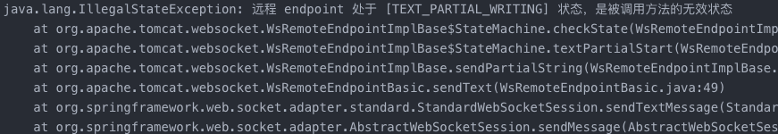

## websocket并发问题

项目中的websocket连接存储在ConcurrentHashMap中，在发送消息时需要将其中的session取出调用sendText方法，如果同时有多个用户对同一名用户发送消息的话就会报错



原因：tomcat下的websocket包没有相关的多线程处理

问题复现：使用<artifactId>spring-boot-starter-websocket</artifactId>创建一个websocket服务端，然后使用<artifactId>Java-WebSocket</artifactId>模拟websocket客户端，然后向同一个在线用户发送消息则会报错。

```java
import java.net.URI;
import java.net.URISyntaxException;
import java.util.*;
import java.util.concurrent.CountDownLatch;
import java.util.concurrent.ExecutorService;
import java.util.concurrent.Executors;

class Main {
    public static void main(String[] args) throws InterruptedException {
        String webSocketUrl = "ws://localhost:8080/globalWs/";
        MyWebSocketClient mainSocket = null;
        try {
            mainSocket = new MyWebSocketClient(new URI(webSocketUrl + "0"));
        } catch (URISyntaxException e) {
            throw new RuntimeException(e);
        }
        mainSocket.connect();

        int userCount = 10;
        ExecutorService executor = Executors.newFixedThreadPool(userCount);
        CountDownLatch latch = new CountDownLatch(userCount);
        for(int i = 1; i < userCount; i++) {
            int finalI = i;
            executor.submit(() -> {
                MyWebSocketClient socket = null;
                try {
                  // 客户端连接服务器
                    socket = new MyWebSocketClient(new URI(webSocketUrl + finalI));
                } catch (URISyntaxException e) {
                    throw new RuntimeException(e);
                }
                socket.connect();
                socket.sendMessage("test from " + finalI);
               while((message = socket.getExcptMessage())==null){
                    System.out.println("服务忙等待...");
                    Thread.sleep(1000);
                }
                //打印服务端返回的数据
                System.out.println("成功获取数据：" + message);
                //关闭连接
                socket.close();
                latch.countDown();
            });
        }
        latch.await();
        executor.shutdown();
        mainSocket.close();
    }
}
```

解决办法：

1. 加锁（synchronized或Reentranlock）

```java
// 获取websocket连接包装对象
GlobalWebSocket socket = CLIENTS.get("0");
// 判断socket是否可用（）
if(socket != null && socket.session.isOpen()) {
  // 对这个socket（或者session）加锁
    synchronized(socket) {
      if(socket.session.isOpen())
        socket.session.getBasicRemote().sendText("to user_" + 0 + " : " + message);
    }
}
```

2. 使用ConcurrentWebSocketSessionDecorator包装

群发或广播场景的代码优化：

群聊场景下消息发送需要遍历群内所有成员，顺序发送容易出现一个session会话网络不好出现超时异常，当前线程会因此中断从而 导致后面的session没有进行发送操作。通过使用线程池，每条消息使用单个线程，单个session情况下避免session之间的相互影响。

```java
public static void broadcast(MessageVo messageVo) {
        CLIENTS.values().forEach(c -> {    
                    Session curSession = c.session;
                    if (curSession.isOpen()) {
                        WEBSOCKET_POOL_EXECUTOR.execute(() -> {
                            synchronized (curSession) {
                                // 双重锁检查，外边的 isOpen 第一遍过滤，里面枷加锁之后，第二遍过滤
                                if (curSession.isOpen()) {
                                    try {
                                     curSession.getBasicRemote().sendText(JSON.toJSONString(messageVo));
                                    } catch (IOException e) {
                                        log.error("发送ws数据错误:{}", e.getMessage());
                                    }
                                }
                            }
                        });
                    }
                }
        );
    }
```

> 参看文献
>
> https://www.cnblogs.com/liuroy/p/7089554.html
>
> https://blog.csdn.net/abu935009066/article/details/131218149
>
> https://blog.csdn.net/qq_38263083/article/details/131811502
